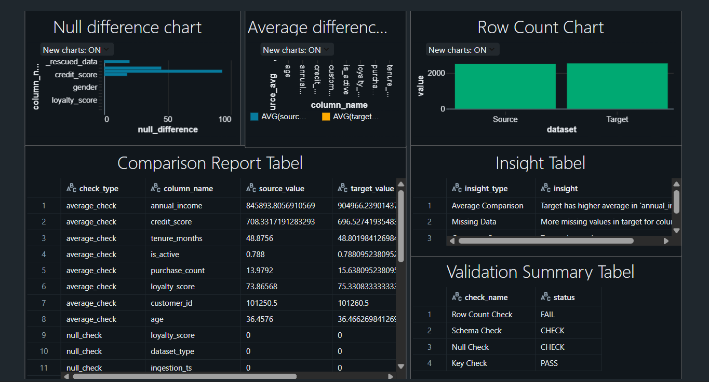
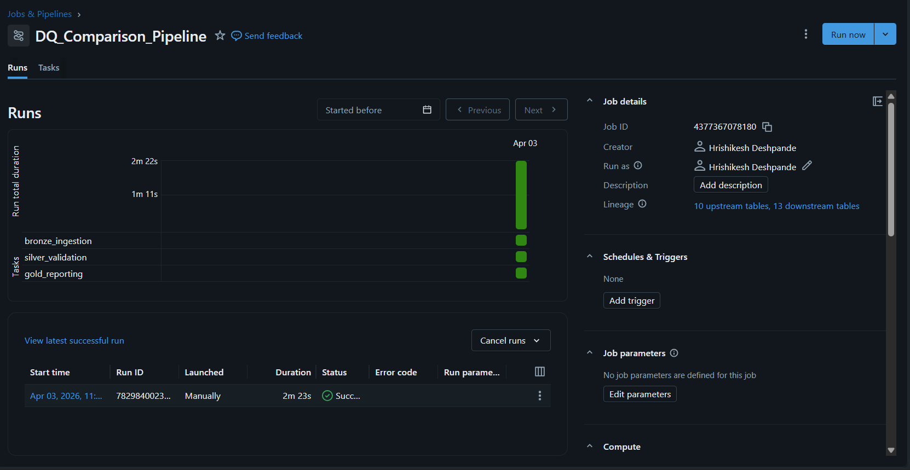

# File Comparison & Data Quality Framework
## 📌 Project Overview

This project is an end-to-end data engineering pipeline built using Databricks and Unity Catalog.  
It compares two datasets (CSV files) and generates a detailed validation report with data quality checks and insights.

---

## 🎯 Problem Statement

Compare two datasets and generate a validation report including:

- Row count comparison  
- Column differences  
- Null value analysis  
- Statistical comparison (avg, min, max)  
- Data quality checks  
- Insight generation  

---
## 📂 Dataset Description

This project compares two CSV datasets:

- `customers_source_2500.csv`
- `customers_target_2520.csv`

### 📊 Dataset Details

Both datasets represent **customer information** typically used in banking/retail systems.

Each dataset contains records related to:

- Customer ID (unique identifier)
- Customer Age
- Annual Income
- Credit Score
- Account Activity Status
- Purchase/Transaction Count

### 🎯 Purpose of Comparison

The goal of comparing these two datasets is to:

- Identify differences between source and target data
- Validate data consistency after data migration or transformation
- Detect data quality issues such as:
  - Missing values
  - Duplicate records
  - Statistical deviations

## 🏗️ Architecture

The project follows a layered architecture:

1. **Data Ingestion**
   - Reads raw CSV files from Azure Data Lake (ADLS)
   - Stores data in Delta format

2. **Data Validation**
   - Performs data quality checks
   - Compares source and target datasets
   - Generates comparison report

3. **Data Insights & Visualization**
   - Extracts meaningful insights
   - Creates visualizations
   - Builds dashboard in Databricks

---

## ⚙️ Technologies Used

- Databricks
- PySpark
- Delta Lake
- Unity Catalog
- Azure Data Lake Storage (ADLS)
- SQL
- Git & GitHub

-----

## 📊 Key Features

- End-to-end pipeline automation  
- Re-runnable pipeline-safe design  
- Data quality framework implementation  
- Statistical comparison between datasets  
- Dashboard creation for insights  
- Pipeline orchestration using Databricks Jobs  

-----

## 🔄 Pipeline Workflow

The pipeline consists of three stages:

1. **bronze_ingestion**
2. **silver_validation**
3. **gold_reporting**

-----

## 📁 Project Structure

file-comparison-dq-framework/
│
├── notebooks/
│ ├── 01_data_ingestion.ipynb
│ ├── 02_data_validation.ipynb
│ ├── 03_data_insights_dashboard.ipynb
│
├── screenshots/
│ ├── dashboard.png
│ ├── pipeline_dag.png
│ ├── pipeline_run.png
│
├── README.md

-----

## 📸 Screenshots

### 📊 Databricks Dashboard

 🔄 Pipeline Workflow (DAG)

-----

## 💡 Key Learnings

- Built end-to-end data pipeline  
- Implemented data quality checks  
- Learned Delta Lake and Unity Catalog  
- Created dashboards in Databricks  
- Automated workflows using pipelines  
